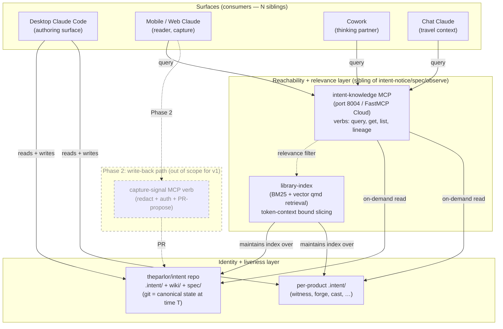

# Substrate Exposure — Architecture Brief

> **Premise (load-bearing).** The substrate is `.intent/` + `wiki/` + the connected knowledge graph it points at. Today it is bound to one desktop filesystem. When Brien travels, the chat surface becomes a stranger — it has memory-fragments of the work, never the work itself. The fix is to make the substrate a **sibling** of the surfaces that consume it, not a **child** of the machine that holds it. (WS-DDR-025, §2b of handoff.)

## TL;DR

**Decision shape (proposed):** MCP-front + repo-as-truth composition. Phase 1 is read-only. Phase 2 adds capture-from-anywhere write-back.

- **Plane of truth:** the `theparlor/intent` repo (and per-product `.intent/` directories in their respective repos). Versioned, git-tracked, append-only-on-events. Single source of truth — already-existing, just under-exposed.
- **Reachability mechanism:** the existing **intent-knowledge MCP server** (port 8004, today specced/CLI-pending) extended to expose substrate query verbs. Runs on FastMCP Cloud / Cloudflare Workers, same infra family as `intent-notice` / `intent-spec` / `intent-observe`.
- **Relevance filter (token-context bound):** `library-index` qmd retrieval (BM25 + vector over the 39k+ file graph) is the slicing layer. Chat surfaces ask for a slice; the MCP server returns top-N relevant chunks. The chat surface never sees the full substrate.
- **Desktop's new role:** one writer (still primary authoring surface) + one reader-of-N. No longer the *only* path to substrate. Demoted from source-of-truth-and-single-point-of-failure to **canonical author** + **mirrored reader**.
- **Constraint check (§5 of handoff):** ✅ Max-subscription compatible — FastMCP Cloud / Cloudflare Workers MCP endpoints are user-owned MCP servers consumed via Anthropic's official MCP transport, not third-party API routing. The existing MCP server family at $0/mo on this exact infra is the proof.

## Why this composition (not either-or)

The handoff named two options (MCP server, committed repo) and predicted the answer is both. It is.

**Repo-as-truth alone** fails because chat surfaces can't read a GitHub repo's `.intent/` directory at chat time without either (a) a network fetch with token burn, or (b) a hosted projection that turns the repo into a queryable surface. Either way, the *useful* read is filtered, ranked, and shaped — which is what an MCP server does.

**MCP-front alone** fails because the server has to read from *something* canonical. Building a sidecar database de-couples truth from the file-native, git-tracked design (DEC-004) — and re-introduces the lock-in the framework explicitly rejects.

**The composition is:** repo as identity + liveness layer (git is the durable, distributed record); MCP server as reachability + relevance layer (the on-demand shaped query). The two collapse into a clean separation of concerns per the §2b framing:

| Concern | Owned by |
|---|---|
| Identity (canonical state at time T) | The repo (git commit hashes are the identity) |
| Reachability (who can read, from where) | The MCP server (FastMCP Cloud endpoint, Anthropic-supported MCP transport) |
| Liveness (is the source-of-truth process online?) | Decoupled — the repo is durable independently of any machine; the MCP server is stateless and serverless (Cloudflare Workers cold-start) |

## Architecture diagram

The desktop appears in this diagram as one of four surfaces. It is structurally indistinguishable from the others *as a reader*; it remains privileged *as a writer* in Phase 1 (lower auth/conflict complexity). Phase 2 adds capture-from-anywhere, at which point even the writer role becomes sibling-composable.

## The four design questions (§3 of handoff) — answered

### Q1 — Query vs. sync (minimum addressable unit)

**Decision:** Query-first. Sync is a Phase 2 add (or never).

**Why:** A chat surface needs to be able to answer "what did Brien decide about X" or "show me the audit signal for the Entire scope work." Both are queries against a structured corpus. Synchronizing a local mirror to every surface duplicates the staleness problem and reintroduces drift between surfaces — which is the substrate-bound-to-one-machine problem in different clothes. Query keeps the repo as the single source of truth and the MCP server stateless.

### Q2 — Read-only vs. read/write

**Decision (Phase 1):** Read-only.

**Why:** Read-only is the fast win with no auth-and-conflict-resolution cost. The point is to make chat-surface Claude useful, not strangered. The capture-from-mobile use case (writing a signal from a coffee shop) is real and valuable, but it carries: (a) auth (who can write?), (b) redaction (does the chat surface see PII?), (c) conflict resolution (what if two surfaces write the same path?). Each is a Phase 2 design loop in its own right.

**Recommended Phase 2 shape:** MCP write verb (`capture_signal`, `propose_intent`, etc.) emits a PR against the repo, not a direct commit. PR-as-arbiter handles auth (GitHub identity), conflict resolution (merge), and gives Brien a review surface. Aligns with DEC-003 (build in the open) and the file-native commitment in DEC-004.

### Q3 — Hosting (constraint crux)

**Decision:** Cloudflare Workers via FastMCP Cloud — same infra as the existing MCP server family.

**Why this satisfies the constraint:** The Max-subscription / April-2026 routing-restriction constraint binds "third-party API routing" — third-party services that Anthropic's Claude products would route requests *to* on the user's behalf. FastMCP-Cloud-hosted MCP servers are **user-owned MCP endpoints** consumed via Anthropic's official **MCP transport**. They are first-party-to-the-user, not third-party. They are the explicit endpoint shape Anthropic added MCP support for.

**Evidence in framework canon:** `Core/frameworks/intent/ARCHITECTURE.md` lines 303-307 names the **three already-deployed** sibling endpoints — `intent-notice.fastmcp.cloud`, `intent-spec.fastmcp.cloud`, `intent-observe.fastmcp.cloud` — at **$0/month** on FastMCP Cloud free tier or Cloudflare Workers (100K req/day). The fourth server (`intent-knowledge`) is specced/CLI-pending per line 111; the hosting decision for it is *not* novel — it is "extend the proven family by one more server on the same infra."

**This unblocks the binding gate** the predecessor handoff flagged as a constraint crux.

### Q4 — Relevance filtering (token-context burn)

**Decision:** Filtering happens **at the MCP server**, not at the client. The server composes with `library-index` (BM25 + vector retrieval over the 39k+ file knowledge graph). Clients ask for a slice; server returns top-N relevant chunks with citation pointers; client never sees the substrate raw.

**Verb shape (proposed for intent-knowledge MCP — see DEC-010):**

| Verb | Returns | Bound |
|---|---|---|
| `query(text)` | Top-K chunks ranked by BM25+vector against the query | K configurable, default 10, max 25 |
| `get(entity_id)` | Single entity by canonical ID (SIG-NNN, INT-NNN, SPEC-NNN, DEC-NNN, WS-DDR-NNN) | One entity |
| `list(type, filter)` | Entity list (title + id + timestamp + status), not full bodies | Default 20, max 50 |
| `lineage(signal_id)` | Backward lineage chain (signal → causing events) and forward lineage (signal → resulting intent → spec) | Bounded by graph traversal depth = 3 |
| `freshness(path)` | Last-modified + last-render state | Single path |

`get` and `lineage` are the only verbs that return full entity bodies — and only one entity per call. `query` and `list` return shaped summaries. This bounds the worst-case context burn at one full entity body per call, not the whole substrate.

## The desktop's recast role

**Before:** desktop is source-of-truth, single point of failure, only path to substrate.

**After (Phase 1):**
- **As writer:** still privileged. Authoring happens at the desktop, lands in git, propagates everywhere on push.
- **As reader:** one of N. Desktop reads `.intent/` directly; mobile/Cowork/chat read via the MCP server. Both reach the same canonical state.
- **As single point of failure:** mitigated. Desktop offline ≠ substrate unreachable. Chat surfaces continue functioning against the repo via MCP server.

**After (Phase 2):**
- **As writer:** sibling among N. Capture-from-anywhere via MCP write verb → PR. Desktop is one of several authoring surfaces.

This is the §2b sibling-as-not-machine transition, executed: identity moves to the repo, reachability moves to MCP, liveness decouples from any single machine.

## Phase 1 / Phase 2 cut

### Phase 1 — tier-aware read-only exposure, internal substrate shipped (ship target: ~2.5-3 weeks of focused work, per D5-refined close)

The architecture is designed tier-aware on Day 1 so engagement substrate adds *config-only* later, not refactor. What ships Day 1 is internal-substrate query; engagement substrate stays scope-locked until per-engagement redaction-maps are authored on demand.

1. **Extend `intent-knowledge` MCP server (port 8004) with the five verbs above.** The server is already specced; the CLI implementation in `bin/intent-knowledge` is pending (Gap 7.1 / track E3 in `.intent/specs/2026-05-20-upgrade-plan.md`). This is the natural next milestone for that track, with the substrate-exposure use case as the forcing function. **Every verb takes a `scope_token` argument from the MCP client config and runs every response through a classification check before return.** This is load-bearing — it's the policy enforcement point that lets engagement-substrate query light up later by config drop, not by refactor.
2. **Compose with `library-index` for relevance filtering.** library-index already runs BM25 + vector over the 39k+ file graph. The intent-knowledge server calls library-index's existing query interface for the `query` verb; `get` / `list` / `lineage` / `freshness` go directly against the repo file tree. **Library-index entries carry classification metadata** so the filter respects scope at retrieval time, not just at response time.
3. **Declare the `.intent/classification.yaml` schema and require it at product creation.** Format: `tier: public | internal | confidential:<engagement>`. Default `internal` if absent for internal products; required-explicit for engagement-shaped paths. `bin/intent-init` (DEC-011) writes the file at scaffold time. The schema is the contract surface that the MCP server reads on every query.
4. **Implement binary classification enforcement at the MCP server.** Day 1 enforcement is binary: scope token matches classification → return content; scope token does not match → return absent (verb-dependent: `query` returns no hits, `get` returns 404, `list` omits, `lineage` truncates with explicit "lineage continues outside your scope" marker). Deferred to Phase 2: the *shaped-view* path that returns a redacted version rather than absent.
5. **Deploy to FastMCP Cloud** as `intent-knowledge.fastmcp.cloud/mcp`, completing the four-server family.
6. **Register the endpoint in chat-surface configs** (Cowork, Claude.ai, mobile) with the Day-1 scope catalog: `internal` for trusted authenticated surfaces, no engagement scopes issued Day 1.
7. **Documentation:** README in `Core/frameworks/intent/knowledge/`, plus a one-line entry in `ARCHITECTURE.md` updating intent-knowledge's "specced; CLI pending" note to "shipped 2026-MM-DD."

**Phase 1 explicit non-goals (defer to Phase 2 or on-demand):**
- Write-back from chat surfaces (PR-as-arbiter path stays Phase 2 per D2 close)
- Sync / offline mirror to surfaces
- **Per-engagement `redaction-map.yaml` authoring** — deferred to when Brien actually needs engagement-substrate query from a no-scope surface. ~30 min one-time per engagement, drops into the already-tier-aware server with no code change.
- **Shaped-view code** (entity → role-token substitution, dollar bucketing, name tokenization). Day 1 enforcement is binary; shaped-view is the second-tier feature that lights up redaction-maps. Phase 2.
- **Inbound redaction (chat → substrate).** Genuinely Phase 2 because it pairs with write-back.
- **Engagement event federation to Witness** — deferred until scope enforcement is hardened post-Phase-1-ship. Witness's append-only conservation law means anything ingested stays, so the conservative default is internal-products-only in the federated store until enforcement has run hot.

### Phase 2 — write-back, redaction-maps, engagement federation (later milestone)

1. **Add `capture_signal` / `propose_intent` MCP verbs** that emit a PR against `theparlor/intent` (or the relevant product repo) rather than a direct commit. PR-as-arbiter handles auth + conflict + review.
2. **Per-engagement redaction-map authoring** — Brien writes one `<engagement>/.intent/redaction-map.yaml` per active engagement when he wants chat-surface query against that engagement substrate. Drops in. The Phase-1-built server reads it.
3. **Shaped-view code at the MCP server** — implements the substitutions declared in the redaction-map.
4. **Inbound redaction shim** at the MCP server — what a chat surface writes back gets classified against the destination product's tier before commit.
5. **Engagement event federation to Witness** — engagement events join the federated event store after Phase-1 scope enforcement has run hot for a defined window. Conservation-law-respecting roll-forward.
6. **Per-product registration** of `.intent/` directories with library-index's index, enabling cross-product query (e.g., "show me all decisions across the portfolio that touch sibling-composition"). Couples cleanly with Track B (each new product running through `intent-init` auto-registers its `.intent/` with library-index).

## What this composes with (not reinvents)

| Existing | Composition role |
|---|---|
| `intent-notice` / `intent-spec` / `intent-observe` MCP servers (8001/2/3) | Sibling MCP servers, same infra family. The new substrate-exposure surface is the fourth member of an existing family, not a new architecture. |
| `intent-knowledge` MCP server (8004, specced/pending) | This is the host. The substrate-exposure verbs become the first complete tool set on this server. |
| `library-index` (BM25 + vector qmd retrieval over 39k+ files) | Relevance-filter composition partner. Already exists, already serves the knowledge-graph slicing role. |
| `Witness` events store + signal emitter | Independent track — does not block. Witness ingests events; substrate exposure exposes the records the events produce. They observe each other through the event stream (an MCP query against substrate could trigger a Witness-observable event "substrate query executed by mobile-surface for SIG-XYZ"). |
| `Cortège` fetch fabric | Latent — if a chat surface ever needs to fetch external content as part of a substrate query (rare), Cortège is the rate-limited backend. Not in Phase 1. |
| Plan-mode "context supply chain" pattern (already used in Code) | Generalized — plan-mode treats the repo as versioned context. Substrate-exposure generalizes that to all surfaces. The MCP server *is* the chat-surface analog of plan-mode's repo-read. |

## Risks + open questions remaining

1. **Latency from chat surface → MCP server → repo + library-index.** Cloudflare Workers cold-start (~100–300ms) + a library-index query (depends on the qmd implementation) + a repo file fetch. Probably acceptable for human-pace queries (~1s end-to-end), but worth measuring on first deploy. Mitigation: aggressive caching of library-index query results, since substrate updates happen at human cadence (not request cadence).
2. **library-index API surface as currently exposed to MCP.** Need to confirm library-index has an existing API surface usable from intent-knowledge — if not, exposing one is a sub-milestone of Phase 1 (and is in scope for the existing E3 track). This is the one engineering unknown.
3. **PII / client-engagement redaction.** Originally proposed as Phase 2; **moved into Phase 1 then refined per Brien's D5-refined close of 2026-05-26**. What's in Phase 1: the tier-aware *architecture* — classification schema, scope-token mechanism, binary enforcement at the MCP server. What's deferred to Phase 2 / on-demand: per-engagement redaction-map authoring, shaped-view substitution code, inbound redaction. The architectural shape never refactors; the redaction *content* lights up when needed.
4. **Identity / auth on the MCP endpoint.** Phase 1 is read-only against public-ish content (Brien's own substrate); auth can default to "any client with the MCP URL." Phase 2 (write-back) forces a real identity story — probably GitHub OAuth for PR-proposal, which aligns with the PR-as-arbiter design.

## Dependency notes (vs. other open tracks)

- **Independent of Witness adapter completion (WIT-004 #5, `entire-io.py` stub).** Witness is the federating substrate for observability events; substrate exposure is the reachability layer for the records `.intent/` already holds. Both are sibling tracks. Track A can ship before Track B's Tier 2 lands.
- **Independent of SPEC-001 Witness ratification.** SPEC-001 is blocked on library-index AM-3 + Conduit OTLP-emit. Substrate exposure does not consume Witness's output; it composes with library-index directly.
- **Depends on intent-knowledge MCP CLI implementation.** That track is already on the upgrade-plan (Gap 7.1 / E3). The substrate-exposure use case is the forcing function for prioritizing it.

## Two-observabilities preservation check

Track A is neither authoring observability nor runtime observability — it is the **reachability layer for the canonical records both observability paths produce and consume.** The authoring path (Entire → events.jsonl) and runtime path (OTel → observations/) both write into `.intent/`-shaped substrate; Track A makes that substrate readable from any surface. DEC-009's frame survives intact; this brief refines neither side of it.

---

*Phase 1 (Cowork) thinking complete. Phase 2 (Code) action: review against Brien's closes in `06-open-decisions-for-brien.md`, then file per the routing table in `00-README.md`.*
