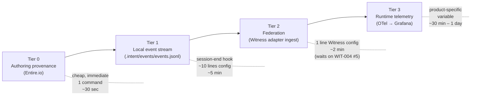

# Spawn a Product — Witness + Entire Composition Runbook

> When you start a new product, project, or client engagement, you do not write per-product observability code. You climb four pre-built tiers. This runbook says exactly how, with the exact commands, the exact cost at each tier, and the prerequisites you can't skip.

## The four-tier composition (settled in DEC-009 + Witness CONTEXT.md)



**Key property:** the tiers are independent. A new product can sit at Tier 0 for a week before climbing. Witness ingests via standard transports (OTLP + structured stderr JSONL); a new product just emits in those formats — **Witness needs no product-specific code per new entrant**. This is the WS-DDR-025 sibling-composition pattern paying off operationally.

## Prerequisites (one-time, portfolio-level)

These are not per-product — set up once, then every new product inherits.

| Prerequisite | Status as of 2026-05-26 | Where it lives |
|---|---|---|
| Entire.io CLI installed (v0.6.1+) | ✅ installed | `/opt/homebrew/bin/entire` |
| OTel Collector binary | ⚠ install on first runtime-telemetry product (Tier 3) | per `observe/README.md` |
| Grafana Cloud account (free tier) | ⚠ provision on first Tier 3 product | grafana.com |
| Witness runtime running (or scheduled) | ⚠ Witness Phase 5 runtime built; SPEC-001 still `draft/blocked` on library-index AM-3 + Conduit OTLP-emit | `Core/products/witness/src/` |
| `entire-io.py` adapter (WIT-004 #5) | ⚠ **stub** — Tier 2 federation goes live when this stub lands | `Core/products/witness/engine/adapters/entire-io.py` |
| `bin/intent-init` scaffold | ✅ **shipped 2026-05-26** (intent@bd3f49f, 40/40 tests pass) — one-command Tier 0+1 scaffold per DEC-011 | `Core/frameworks/intent/bin/intent-init` |
| `hooks/session-end.sh` Tier 1 emitter | ✅ **shipped 2026-05-26** (intent@b6d837d) — OTel-shaped session.end event emitter, installed per-product by `bin/intent-init` | `Core/frameworks/intent/hooks/session-end.sh` |
| `.intent/classification.yaml` schema v1 | ✅ **shipped 2026-05-26** (intent@63c84ba) — universal per-product classification declaration | `Core/frameworks/intent/spec/classification-schema.md` |

**Honest status today:** Tier 0 and Tier 1 are achievable end-to-end via `bin/intent-init` (one command, ~30 sec). Tier 2 awaits WIT-004 #5 implementation for the Entire-trace federation path; the `intent-events-jsonl.py` adapter path is already live. Tier 3 awaits per-product OTel emission, which is product-by-product.

## Tier 0 — Authoring provenance (Entire)

**What it gives you:** every agent session in this product's repo gets recorded — prompts, tool calls, files touched, transcripts, token usage. Granularity = git commit + intra-session checkpoints. (DEC-009 scope.)

**Per-product cost:** 1 command, ~30 seconds.

```bash
cd <product-repo>
entire enable
# creates .entire/ with settings.json {"enabled": true}
# subsequent agent sessions auto-capture to .entire/metadata/<session-uuid>/full.jsonl
```

**Verify:** start an agent session; on exit, check `.entire/metadata/` for a new UUID-named directory containing `full.jsonl`.

**You are now at Tier 0.** A product can sit here permanently and still get real value: when a question comes up about "how did this code get written," the authoring trace exists. This is the legitimate "Tier 0 adoption value" preserved in DEC-009.

## Tier 1 — Local event stream

**What it gives you:** structured events in `.intent/events/events.jsonl` — agent decisions, signal captures, intent proposals, spec ratifications, contract assertions. This is the product's own observable record, sibling to `.entire/` not subsumed by it.

**Per-product cost:** ~10 lines of session-end hook config, ~5 minutes.

```bash
cd <product-repo>
mkdir -p .intent/events
# Install the session-end hook (writes to .intent/events/events.jsonl on session close)
cp /Users/brien/Workspaces/Core/frameworks/intent/hooks/session-end.sh .claude/hooks/session-end
chmod +x .claude/hooks/session-end
# Test: run a session, then verify
tail -1 .intent/events/events.jsonl
```

**What the hook emits (OTel-shaped per DEC-004):**

```json
{
  "trace_id": "...",
  "span_id": "...",
  "timestamp": "2026-05-26T15:00:00Z",
  "source.system": "<product-name>",
  "source.instance": "<session-uuid>",
  "event_type": "session.end",
  "attributes": {
    "files_touched": [...],
    "commit_sha": "...",
    "signals_captured": [...],
    "decisions_recorded": [...]
  }
}
```

**Verify:** `.intent/events/events.jsonl` exists, last line parses as JSON, has `source.system` populated.

**You are now at Tier 1.** The product has both an authoring trace (Tier 0) and a structured event log (Tier 1). These are siblings — Tier 0 is the deep reasoning trail; Tier 1 is the OTel-shaped event record.

## Tier 2 — Federation (Witness ingest)

**What it gives you:** the product's events join the cross-portfolio event substrate. Patterns across products become observable. Signal lineage spans products. The library-index daily-health-summary, the Conduit OTLP stream, Entire traces from every product, and `.intent/events/events.jsonl` from every product all land in the same addressable substrate (per Witness CONTEXT.md).

**Per-product cost:** 1 line in Witness config, ~2 minutes — but live only when the `entire-io.py` adapter ships (WIT-004 #5).

**Today's procedure (registration-only; activation when stub lands):**

```bash
# In Core/products/witness/.intent/registered-products.yaml (or analog — see DEC-011)
- product: <product-name>
  path: Core/products/<product-name>/
  sources:
    - { type: entire-io, path: .entire/metadata/*/full.jsonl }
    - { type: intent-events, path: .intent/events/events.jsonl }
```

**What Witness does on its side (per CONTEXT.md):**
- Tails `.entire/metadata/<uuid>/full.jsonl` via the `entire-io.py` adapter (when implemented).
- Tails `.intent/events/events.jsonl` via the `intent-events-jsonl.py` adapter (✅ already implemented per `engine/adapters/`).
- Tags every event with `source.system: <product-name>` so the federation preserves attribution.
- Promotes signal-worthy patterns to `<product>/.intent/signals/` with `caused_by` lineage back to the originating events.

**Adapter dependency note (honest):**
- `intent-events-jsonl.py` adapter — ✅ implemented. Tier 1 → Tier 2 path for `.intent/events/events.jsonl` is live today.
- `entire-io.py` adapter — ⚠ **stub.** Tier 0 (Entire) → Tier 2 federation is NOT live yet. Implement per WIT-004 migration order #5 when scheduled. Until then, Tier 2 ingests only the Tier-1 stream from this product, not the Tier-0 Entire trace.

**Verify (post-WIT-004 #5):** trigger a session in the new product; within Witness's ingest window, query the events store for `source.system: <product-name>` and confirm both event types arrive.

**You are now at Tier 2** — the product's authoring and structured event records federate with the rest of the portfolio.

## Tier 3 — Runtime telemetry

**What it gives you:** the running artifact emits its own runtime observations — contract pass/fail, latency distributions, error rates, custom metrics. Closes the Observe → Notice loop (per `observe.html`). This is the "did the artifact work?" half of the two-observabilities frame (DEC-009).

**Per-product cost:** variable — depends on the runtime surface.

| Product runtime shape | Tier 3 climb |
|---|---|
| Has a long-running process / server | ~30 minutes — OTel SDK integration, span emission at key entry points, point at the OTel Collector |
| CLI / batch / cron | ~15 minutes — stderr JSONL emission to Witness's `ingest_jsonl` adapter (no OTel SDK required; per Option B in Witness CONTEXT.md) |
| Pure document / spec product (no runtime) | Not applicable — the product never enters Tier 3 |

**Standard runtime emission (the helper that does not yet exist as a published package):**

```python
# Proposed: Core/frameworks/intent/observe/adapters/lib_emit.py
# Thin wrapper over opentelemetry-sdk so products import {start_span, log_event}
# rather than reimplement OTel boilerplate per-product.
from intent_observe import start_span, log_event

with start_span("my_operation", source_system="my-product"):
    log_event("operation.started", attributes={...})
    # ...do the work...
    log_event("operation.completed", attributes={...})
```

**Where the emission goes (per `observe/README.md`):**

```
CLI/MCP/GitHub -> events.jsonl -> File Tail Adapter -> OTel Collector -> Grafana Cloud (Tempo + Mimir + Loki)
```

For non-OTel CLI/cron products, the same data flows via Witness's stderr-JSONL ingest path — see CONTEXT.md "OTLP-native ingest surface" section.

**You are now at Tier 3.** The product's runtime behavior is observable. The Notice → Spec → Execute → Observe loop closes.

## Per-product cost summary

| Tier | Cost | Value | Status (2026-05-26) |
|---|---|---|---|
| 0 — Entire | 1 command, ~30 sec | Authoring provenance | ✅ ready |
| 1 — events.jsonl | 1 command via `bin/intent-init`, ~30 sec | Local structured event log | ✅ ready (shipped 2026-05-26) |
| 2 — Witness federation | 1 config line, ~2 min | Cross-portfolio event substrate | ⚠ partially live — `intent-events-jsonl.py` adapter works; `entire-io.py` adapter is a stub |
| 3 — Runtime telemetry | 15 min – 1 day | Closed Observe→Notice loop | ⚠ stack ready; per-product OTel emission is product-specific |

## The scaffold script (DEC-011, shipped 2026-05-26) — tier-aware Day 1, engagement federation deferred

`bin/intent-init <product-name>` collapses Tier 0 + Tier 1 into one command. Per Brien's D5-refined close (2026-05-26), the scaffold is **tier-aware from Day 1** — every product gets a classification declaration at creation — but Witness federation for engagement-tier substrate is **deferred** until Phase 1 scope enforcement is hardened. Internal-tier products federate Day 1.

**Shipped:** intent@bd3f49f (CLI) + intent@63c84ba (schema doc) + intent@b6d837d (session-end hook). 40/40 tests passing in `bin/test-intent-init.sh`.

```bash
# CLI shape (DEC-011, D5-refined)
bin/intent-init my-new-product \
  --path Core/products/my-new-product/ \
  --enable entire,events \
  --classification internal \       # one of: public | internal | confidential:<engagement-name>
  --register-with witness            # defaults ON for internal; auto-deferred for engagement

# Internal example (federation ON Day 1):
bin/intent-init my-new-product \
  --path Core/products/my-new-product/ \
  --enable entire,events
# → .intent/classification.yaml written: tier: internal
# → registered with Witness Day 1
# → echo: "Product 'my-new-product' at Tier 1, classification 'internal'. Federation: ON."

# Engagement example (federation deferred):
bin/intent-init subaru-q3-2026 \
  --path Core/engagements/subaru-q3-2026/ \
  --enable entire,events \
  --classification confidential:subaru
# → .intent/classification.yaml written: tier: confidential:subaru
# → NOT registered with Witness yet — federation flips on after Phase 1 scope enforcement runs hot
# → echo: "Engagement 'subaru-q3-2026' at local Tier 0+1, classification 'confidential:subaru'. Federation: DEFERRED."

# Behavior:
# 1. mkdir -p <path>/{.intent/{events,signals,intents,specs},.entire}
# 2. cd into that dir and run `entire enable`
# 3. Install the session-end hook
# 4. Write .intent/classification.yaml with the declared tier (REQUIRED — schema enforced; CLI errors out on engagement-shaped paths without explicit --classification)
# 5. Append the product to Core/products/products.json (or engagements.json for confidential:* tier)
# 6. Witness registration logic:
#    - tier `public` or `internal` → register Day 1 (default ON)
#    - tier `confidential:*` → register DEFERRED (Phase 2 — Witness conservation law makes this the conservative default)
# 7. Echo classification + federation status so the operator sees what just happened
```

**Why the classification schema is universal even though only internal-tier federates Day 1:** the architecture commitment is that classification is a property of every product, declared at birth. Phase 1 only deploys the internal-tier query path on the substrate-exposure MCP server, but the schema is universal so Phase 2's engagement-tier light-up is a config change, not a per-product retrofit. This is the "tier-aware Day 1, redaction-map deferred" pattern operationalized at the scaffold layer.

Lives at `Core/frameworks/intent/bin/intent-init` — close to framework canon, callable from anywhere via the existing `bin/` family (per `Core/frameworks/intent/bin/` already containing other framework CLIs).

**Design choice notes:**
- *Not in `~/.claude/scripts/`* — that's developer-local, this is framework-canonical.
- *Not in a new `Core/products/scaffolding/`* — that creates a meta-product with one tool and no other inhabitants, violating product-shape conventions.
- *In `bin/intent-init`* — sibling of any other framework CLI Brien spawns (e.g., `bin/intent-knowledge`, `bin/intent-observe`).

## Per-product registry (DEC-011 side-effect)

Today, products self-register by being listed in `Core/products/products.json` (40-ish entries, manually curated). Tier 2 federation needs a sister registry telling Witness which products to ingest from.

**Proposed:** `Core/products/witness/.intent/registered-products.yaml`, populated by `bin/intent-init --register-with witness` (default ON per D5). Each entry carries the product's classification tier so Witness preserves attribution and downstream consumers (substrate-exposure MCP, etc.) can apply per-tier policy. Format above + classification field. Witness's adapters tail every registered path on a configurable interval.

**Discovery alternatives considered (and rejected):**
- *Auto-discovery scan of `Core/products/*/.entire/` and `.intent/events/`* — rejected because classification metadata still needs to be declared explicitly; auto-discovery without explicit classification would default-leak confidential content. Explicit registration writes classification at creation time.
- *Sibling-registry pattern (each product self-registers by writing to a Witness-watched path)* — rejected as more complex than needed for current scale; can revisit if portfolio grows past ~50 products.

### Engagement classification — operational notes (D5-refined)

Per Brien's D5-refined close, client engagements (Subaru, ASA, etc.) are scaffolded with full classification metadata from Day 1, but federation and chat-surface query against engagement substrate is deferred until Phase 1 scope enforcement is hardened and per-engagement redaction-maps are authored on demand.

| Layer | Internal product (Day 1) | Engagement (Day 1) | Engagement (Phase 2 light-up) |
|---|---|---|---|
| Tier 0 (Entire) | Records authoring sessions to `.entire/` | Same — local capture | Unchanged |
| Tier 1 (events.jsonl) | Records structured events to `.intent/events/events.jsonl` | Same — local capture | Unchanged |
| Tier 2 (Witness federation) | **ON Day 1** — events ingest into Witness's event store, tagged `source.system: <product>`, classification `internal` | **DEFERRED** — engagement events stay local, conservation law not yet exercised on confidential content | **Flips ON** after scope enforcement hot-runs successfully; engagement events backfill or roll-forward per Brien's call |
| Tier 3 (Runtime telemetry) | OTel emission to Grafana per standard path | Same when applicable | Unchanged |
| Substrate exposure (Track A MCP) | Queryable from any internal-scope surface Day 1 | Scope-locked Day 1 — no-scope chat surface gets "no results" / 404 | Per-engagement redaction-map authored (~30 min one-time); shaped-view code lights up; engagement substrate queryable with engagement-scope token |

The `.intent/classification.yaml` per product (written by `bin/intent-init`) is the load-bearing per-product declaration that exists Day 1 for *every* product regardless of tier. The substrate-exposure surface (Track A) reads it on every query and applies the binary classification check Day 1 (returns absent if no scope match). The shaped-view path that turns absent into redacted-but-readable lights up in Phase 2 when redaction-maps are authored.

## Cross-track dependencies (Track A ↔ Track B)

Tracks A and B are siblings, not parent-child. But they compose:

1. **Track A surfaces what Track B produces.** Once Tier 1+ products federate via Witness, the substrate-exposure MCP server (Track A) can answer cross-product queries: "show me every signal captured this week across the portfolio." This is the *payoff* of doing both tracks — the substrate becomes richer than any single product's view.
2. **Track B benefits from Track A's reachability.** Once the substrate is exposed via MCP, a chat surface can read a product's `.intent/decisions.md` from anywhere — making Tier 0/1 valuable from any consumption surface, not just the desktop where the records were captured.

Neither track blocks the other for shipping. Track A's Phase 1 can ship before Track B's Tier 2 lands; Track B's Tier 0–1 climb works fine without Track A.

## Open dependencies

| Dependency | Status | Tier affected | Mitigation while pending |
|---|---|---|---|
| `bin/intent-init` scaffold (DEC-011) | ✅ shipped 2026-05-26 (intent@bd3f49f, 40/40 tests) | Tier 0+1 setup | One command, ~30 sec |
| `entire-io.py` Witness adapter (WIT-004 #5) | stub | Tier 2 (Entire path only) | Tier 2 still works for `.intent/events/events.jsonl` via the implemented `intent-events-jsonl.py` adapter; Entire-trace federation goes live when stub lands |
| library-index AM-3 audit | pending | Witness SPEC-001 ratification | Witness runtime already operates; ratification is a governance milestone, not a blocker for using Witness |
| Conduit OTLP-emit path | pending | Witness SPEC-001 ratification | Same as above |
| Standard OTel emission helper (`intent_observe.lib_emit`) | not yet shipped | Tier 3 boilerplate reduction | Products doing Tier 3 today write OTel SDK calls directly — ~30 lines instead of ~5 |

## Two-observabilities preservation check

This runbook is the *operational* encoding of DEC-009. Tier 0 (Entire) is the authoring-side path. Tier 3 (OTel) is the running-system path. Tiers 1 and 2 are the substrate that lets the two paths produce comparable, federatable, lineage-bearing records. Both paths land in the same event shape (per Witness's conservation law); neither path is collapsed into the other. The frame holds.

## What this runbook does NOT do

- It does not implement `bin/intent-init`. (That's a Phase 2 filing decision, DEC-011 proposes it.)
- It does not implement `entire-io.py`. (That's WIT-004 #5, scheduled separately.)
- It does not ship the `intent_observe.lib_emit` helper. (Future small milestone.)

What it does: it tells Brien (and any future agent reading this) exactly how to bring a new product into the observability fabric, mechanically, today — and exactly which steps are still manual until the proposed scaffolds land.

---

*Phase 1 (Cowork) thinking complete. Phase 2 (Code) action: review against Brien's closes in `06-open-decisions-for-brien.md`, then file to `Core/frameworks/intent/playbooks/spawn-a-product.md`.*
